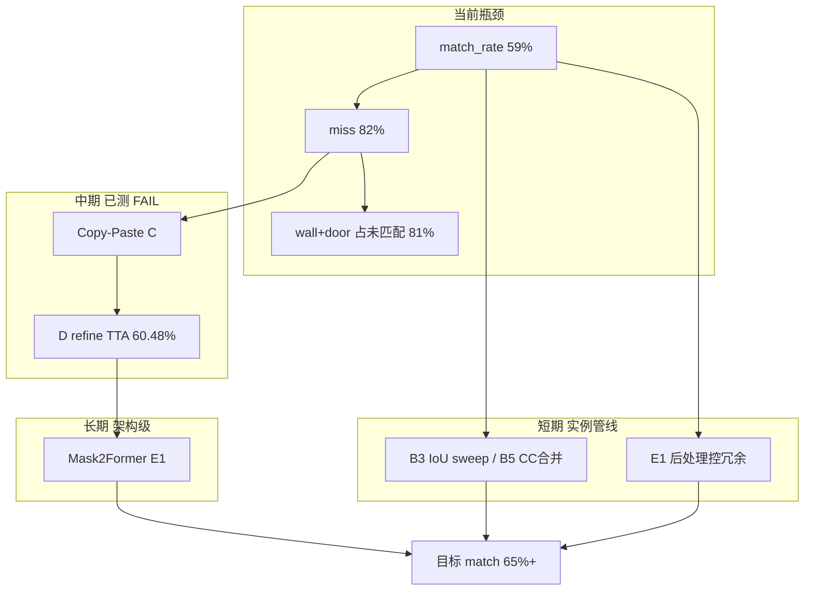

# E2E 实例匹配偏低 — 根因分析与改进方案


| 项目      | 内容                                                                  |
| ------- | ------------------------------------------------------------------- |
| 文档版本    | v1.9                                                                |
| 编写日期    | 2026-05-26                                                          |
| 关联文档    | 《E2E_性能分析与改进方案.md》《E2E_segment_and_classify_测试说明.md》《项目实施步骤指南.md》《**E2E_后续提升方案_F阶段.md**》（B～E 完成后）   |
| 评测基准    | `outputs/e2e_segment_classify/val_full/`（v2@6k 分割 + P3 分类，无 E1 后处理） |
| E2-0 审计 | `outputs/e2e_improve/e2_audit_baseline/`                            |


---

## 1. 问题陈述

### 1.1 现象

在全量 val（1000 张、3105 个 GT 实例）端到端流水线中：


| 指标                | 数值         | 含义                              |
| ----------------- | ---------- | ------------------------------- |
| **实例 match_rate** | **59.32%** | 约 **41%** GT 实例在预测侧找不到可对齐的 mask |
| 未匹配 GT 数          | **1263**   | 这些实例无法进入分类与下游处理                 |
| **严格端到端 Acc**     | **≈49.9%** | 匹配 + 分类全对的比例不足一半                |
| pred/GT 比         | **1.148**  | 预测实例偏多（过分割噪声）                   |
| 匹配后分类 Acc         | **84.09%** | **对上之后**分类尚可                    |
| 匹配后 grasp Acc     | **90.83%** | 拒识后更稳                           |


**核心矛盾**：分割 mIoU **81.80%**、匹配后语义类正确率 **92.94%**，但实例 match_rate 仅 **~59%** —— **像素级分割与实例级定位是两套指标**，后者才是 E2E 成败的关键。

### 1.2 与 E2E 流水线的因果关系

```text
全图 → SegMAN 语义分割 → 连通域提实例 → mask IoU 匹配 GT
                                              │
                    match 失败 ────────────────┤→ 无可靠 bbox/mask → 无法分类/下游失败
                    match 成功 ────────────────┤→ 分类 → grasp/reject 决策
```

**结论**：在全自动 pipeline 下，**约 41% 的标注实例无法被定位**，这是严格 E2E Acc 卡在 50% 附近的首要原因。分类精度（67～77% 离线）是次要矛盾。

---

## 2. 数据分解

### 2.1 按类别：谁拖累了 match_rate


| 类          | GT 实例 | 匹配数 | **匹配率**    | 未匹配 | 占全部未匹配比   |
| ---------- | ----- | --- | ---------- | --- | --------- |
| **wall**   | 1290  | 621 | **46.43%** | 669 | **53.0%** |
| **door**   | 663   | 304 | **45.85%** | 359 | **28.4%** |
| window     | 130   | 76  | 58.46%     | 54  | 4.3%      |
| bottle     | 223   | 175 | 78.48%     | 48  | 3.8%      |
| box        | 88    | 57  | 64.77%     | 31  | 2.5%      |
| shelf      | 62    | 34  | 54.84%     | 28  | 2.2%      |
| jar_kettle | 133   | 106 | 79.70%     | 27  | 2.1%      |
| cup        | 366   | 345 | **94.26%** | 21  | 1.7%      |
| eyeglass   | 92    | 81  | **88.04%** | 11  | 0.9%      |
| bowl       | 38    | 29  | 76.32%     | 9   | 0.7%      |
| freezer    | 20    | 14  | 70.00%     | 6   | 0.5%      |


**要点**：

- **wall + door** 合计 1953 个 GT（**62.9%**），贡献 **1028** 个未匹配（**81.4%**）。抬升整体 match_rate 必须优先解决结构类。
- **cup / eyeglass / bottle** 匹配率 78～94%，是 E2E 的「高可靠类」。
- **door / wall / shelf / window** 匹配率 45～58%，自动抓取风险高。

### 2.2 按根因：E2-0 启发式审计（baseline）

对 1263 个未匹配 GT 实例，按 §4.1 taxonomy 自动归类：


| 根因                 | 数量   | 占比        | 含义                                 |
| ------------------ | ---- | --------- | ---------------------------------- |
| **miss 漏检**        | 1035 | **81.9%** | 预测 mask 与 GT 实例 max IoU **< 0.10** |
| **iou_gap IoU 不足** | 228  | **18.1%** | 有重叠但 IoU ∈ [0.10, 0.30)，低于匹配阈值     |
| adhesion 粘连        | ≈0*  | —         | baseline 未匹配集中未单列（见 §4.3）          |
| fragment 碎裂        | ≈0*  | —         | 同上                                 |
| class_swap 语义错类    | ≈0*  | —         | 同上                                 |


 E1 后处理审计（`e2_audit_e1_best/`）中 adhesion/fragment/class_swap 合计 **<5%**，仍远小于 miss。

**wall / door 分表**：


| 类    | miss            | iou_gap     |
| ---- | --------------- | ----------- |
| wall | 553 (**82.7%**) | 116 (17.3%) |
| door | 294 (**81.9%**) | 65 (18.1%)  |


**决策结论（E2-0）**：未匹配由 **漏检主导**，而非粘连或后处理参数 alone 可解决。

### 2.3 为何 mIoU 高但 instance match 低


| 维度         | 像素级 mIoU        | 实例级 match                              |
| ---------- | --------------- | -------------------------------------- |
| 统计单位       | 每个像素是否分对类       | 每个 GT 连通域是否有 pred CC 且 IoU≥0.3         |
| wall 类 IoU | **~83%**        | 匹配率 **~46%**                           |
| 典型场景       | 大面积 wall 像素预测正确 | 同图 **多个** GT wall 实例，pred 只覆盖其中一块或整块合并 |
| 训练目标       | 语义分割 CE/Dice    | **未直接优化**实例召回与 CC 对齐                   |


**「mIoU 81.8% + match 59%」并存的原因**：

1. **GT 实例定义**：从语义标注图按类做 8-连通域得到；Trans10K 一图常有 **多个** wall/door 实例（均值 wall **1.29 个/图**）。
2. **预测倾向**：模型常输出 **连续大区域** 或 **漏掉嵌入墙体的 door**，像素平均 IoU 仍高。
3. **一对一贪心匹配**：每个 pred 实例最多匹配一个 GT；大 pred CC 吃掉一个 GT 后，同区域其余 GT 全部算 miss。
4. **阈值 0.3**：228 例 iou_gap 本有弱重叠，但不够格。

---

## 3. 根因体系（五层）

### 3.1 层 1 — 任务与标注结构（系统性）


| 问题          | 说明                                                                                   |
| ----------- | ------------------------------------------------------------------------------------ |
| 语义分割 ≠ 实例分割 | 流水线用 `cv2.connectedComponents` 从 **语义 label map** 派生实例；标注方同样如此。真实「物体实例」边界与 CC 边界不一致。 |
| 结构类实例化规则    | wall/door 在室内图中 **碎、多、互相邻接**；GT 按连通域切分，与人体感知的「一扇门、一面墙」不对齐。                           |
| 类别不均衡       | 62.9% GT 为 wall/door；match 指标被结构类绑架。                                                 |


**影响**：即使分割「看起来对」，实例级指标仍可能很差；这不是单纯调参能彻底消除的。

### 3.2 层 2 — 分割漏检（主因，~82% 未匹配）

**判定**：GT 实例区域上，所有 pred CC 的 max mask IoU **< 0.10**。


| 机制           | 典型类                | 说明                                       |
| ------------ | ------------------ | ---------------------------------------- |
| 小目标/薄结构      | shelf, box, window | 面积低于感受野或训练样本少                            |
| 透明/低对比       | bottle, door 玻璃    | LASS 仍不足                                 |
| 嵌入大背景        | door in wall       | 语义上易被 wall 吞没                            |
| 训练 recall 偏置 | wall, door         | mIoU 优化对 **大面积类** 更友好，小 door 实例 recall 低 |


**实验佐证**：

- P0 弱类 finetune：mIoU 81.0% 仍 **FAIL**（SegMAN-ROI Acc 下降）。
- E2-1（boundary loss + 弱类 schedule）：E2E match **58.39%**（**低于** baseline 59.32%），未通过 E2-2 闸门。

### 3.3 层 3 — 实例提取与后处理（次要，~18% + 噪声）

**流水线逻辑**（`roi_extract.py` + `roi_postprocess.py`）：

```text
语义图 → 每类 8-连通域 → min_area 过滤 → (可选) NMS → 实例列表
```


| 问题          | 表现                         | 当前状态                                      |
| ----------- | -------------------------- | ----------------------------------------- |
| 过分割         | pred/GT=1.148，多 458 个 pred | E1 NMS+min_area128 可压到 1.046，**match 不升** |
| 欠分割         | 多 GT 对应 1 pred             | 贪心匹配后其余 GT → miss                         |
| min_area 误杀 | shelf 等小实例                 | E1 `min_area_shelf=32` 略缓解，match 仍 ~59%   |
| 无跨 CC 合并/分裂 | wall 碎块无法合并                | **未实现**                                   |


**E1 实验结论**（公平 GT=3105）：7 组配置 **无一** 达到 match≥62%；后处理 **控冗余有效，不抬召回**。

### 3.4 层 4 — 匹配协议（评测层，非训练主因）


| 项      | 现状                               | 影响                                     |
| ------ | -------------------------------- | -------------------------------------- |
| 算法     | 逐 GT 贪心取 max IoU pred，pred 不重复使用 | 一对多、多对一均算未匹配                           |
| IoU 阈值 | 默认 **0.3**                       | 228 例 iou_gap；降到 0.25 仅 +0pt 量级（E1 已测） |
| 匹配对象   | **mask IoU**（非 bbox）             | 比 bbox 严格，边界偏 1～2px 即掉分                |


**说明**：放宽阈值或匈牙利算法可 **略改评测数字**，不增加真实可抓取 mask 质量；抓取仍依赖 pred mask 几何准确。

### 3.5 层 5 — 分类与匹配的耦合（E2E 视角）


| 现象           | 数据                                  |
| ------------ | ----------------------------------- |
| 匹配上后分类 Acc 高 | 84%（全匹配）/ 91%（grasp）                |
| 结构类匹配上后仍弱    | door 69%、window 59%、shelf 50%       |
| 严格 E2E       | match × cls ≈ 0.59 × 0.84 ≈ **50%** |


**含义**：**先解决 match，再谈分类**；对 door/wall 即使 match 成功，分类仍需拒识或人工确认。

---

## 4. 根因 taxonomy（本项目统一定义）

与 `export_unmatched_instances.py` 一致，优先级：**miss > adhesion > fragment > iou_gap > class_swap**。


| 代码             | 判定条件                         | 典型目视          | 未匹配中占比 (baseline) |
| -------------- | ---------------------------- | ------------- | ----------------- |
| **miss**       | max IoU **< 0.10**           | GT 区域几乎无 pred | **81.9%**         |
| **adhesion**   | door↔wall 合并 CC，IoU≥0.10 但类错 | 门墙连成一片        | E1 审计 ~1%         |
| **fragment**   | ≥2 pred CC，各 IoU < 0.30      | 大墙被撕碎         | E1 审计 ~1.5%       |
| **iou_gap**    | 类对、单 CC、IoU ∈ [0.10, 0.30)   | mask 缩偏       | **18.1%**         |
| **class_swap** | 类错且 IoU≥0.10                 | window→wall   | E1 审计 ~1%         |


---

## 5. 已尝试方案与结论


| 阶段          | 手段                          | match_rate | pred/GT   | 结论                  |
| ----------- | --------------------------- | ---------- | --------- | ------------------- |
| baseline    | 无后处理                        | **59.32%** | 1.148     | 基准                  |
| E1 最佳       | min128+NMS+iou0.25+shelf32  | 59.16%     | **1.046** | ✅ 减冗余 ❌ 不抬 match    |
| E2-1 e2weak | boundary loss + 弱类 finetune | **58.39%** | 0.995     | ❌ 回退，不替换 v2@6k      |
| P0 弱类分割     | class_weight finetune       | （离线 ROI↓）  | —         | ❌ SegMAN-ROI 61.81% |


**归纳**：

- **后处理 / 边界 loss alone** 无法解决 **miss 主导** 的问题。
- 需要 **面向 recall 的训练策略**（Copy-Paste、难例增广）或 **改变实例化/交互方式**。

---

## 6. 改进方案

### 6.1 方案总览

```text
           ┌─────────────────────────────────────────────────────────┐
  短期     │ B. 评测与实例管线微调 — 有限抬升 + 可解释性（1～3 天）    │
           └─────────────────────────────────────────────────────────┘
           ┌─────────────────────────────────────────────────────────┐
  中期     │ C. 分割训练（miss 导向）— Copy-Paste + 弱类 recall  ✅ FAIL   │
  2～4 周  │ D. 推理 mask refine — morph/dilate/CRF/TTA（iou_gap）  ← 当前 │
           └─────────────────────────────────────────────────────────┘
           ┌─────────────────────────────────────────────────────────┐
  长期     │ E. 架构升级 — Mask2Former / SAM / Det+Seg 混合  ← 当前 │
  可选     │ F. 多模态 — 深度/点云辅助实例分离                         │
           └─────────────────────────────────────────────────────────┘
```

### 6.2 方案 B — 实例管线微调（低风险，1～3 天）


| 编号  | 措施                  | 实现位置                         | 说明                                   |
| --- | ------------------- | ---------------------------- | ------------------------------------ |
| B1  | 部署 E1 冗余控制          | `run_e2e_regression.sh` 默认参数 | pred/GT→1.05，match 持平                |
| B2  | 匈牙利匹配（评测）           | `match_instances_to_gt()`    | 减少贪心错配；**评测用**，可选同步部署                |
| B3  | 按类 IoU 阈值           | door/wall 0.25，cup 0.35      | 仅影响 eval 统计，需文档注明                    |
| B4  | shelf `min_area=32` | 已支持 `--min-area-shelf`       | 小 shelf recall 略升                    |
| B5  | **pred 同类 CC 合并**   | 新增 `merge_nearby_cc()`       | 对 wall 碎块合并后再匹配，针对 fragment（需 A/B 测） |


**预期**：match **+0～2 pt**；**不能**单独达到 65% 目标。

#### 6.2.1 方案 B 执行手册（步骤 / 命令 / 目的）

> **工期**：1～3 天（B1/B4 可立即跑；B2/B3/B5 需改代码）。  
> **环境**：Docker 容器 `segman_train`，工作目录 `/workspace/segman`（与本地 `SegMAN/` 同步）。  
> **原则**：GT 实例提取 **固定** `min_area=64`、无 NMS；**仅预测侧**施加后处理（公平口径，GT=3105）。

---

##### 总流程

```text
Step 0  记录 baseline（可选，已有 val_full 可跳过）
  ↓
Step 1  B1 部署 E1 冗余控制（min_area + NMS + aspect）
  ↓
Step 2  B4 shelf 小面积阈值（与 B1 同一套参数）
  ↓
Step 3  B3 sweep IoU 匹配阈值（0.25 / 0.28 / 0.30）
  ↓
Step 4  B2 实现匈牙利匹配 → 重跑 Step 3 对比
  ↓
Step 5  B5 实现同类 CC 合并 → 重跑 Step 3 对比
  ↓
Step 6  选定 deploy 参数 + 更新 regression 脚本 + 写台账
```

**验收汇总表**（与 baseline `val_full` 对比，GT=3105）：


| 指标                  | baseline | B 方案目标        | 说明       |
| ------------------- | -------- | ------------- | -------- |
| match_rate          | 59.32%   | ≥59%（+0～2 pt） | 不显著下降即可  |
| pred_gt_ratio       | 1.148    | **≤1.06**     | B1 核心收益  |
| redundancy_excess   | 458      | **≤200**      | pred−gt  |
| e2e_top1_on_matched | 84.09%   | **≥83%**      | 后处理勿误杀真例 |
| wall 未匹配            | 669      | 略减即可          | B5 主要受益类 |


---

##### Step 0 — 确认 baseline（目的：对照基准）

**目的**：后续所有 B 实验必须与同一 baseline 对比；确认 GT 实例数=3105（公平口径）。

**命令**（若已有 `outputs/e2e_segment_classify/val_full/` 可跳过）：

```bash
cd /workspace/segman
source /root/anaconda3/etc/profile.d/conda.sh && conda activate segman

python transgrasp/pipelines/segment_and_classify.py \
  --eval-split val --max-images -1 \
  --out-dir outputs/e2e_segment_classify/val_full

python transgrasp/pipelines/summarize_e2e_eval.py \
  --eval-dir outputs/e2e_segment_classify/val_full
```

**验收**：`summary.json` 中 `num_gt_instances=3105`，`match_rate≈0.5932`。

---

##### B1 — 部署 E1 冗余控制


| 项      | 内容                                                                                        |
| ------ | ----------------------------------------------------------------------------------------- |
| **目的** | 过滤预测侧过小连通域、极端细长 CC、同类重复 bbox，将 pred/GT 从 **1.15 压到 ~1.05**，减少 pred 实例噪声；**不指望大幅抬 match**。 |
| **手段** | `min_area=128`；`nms_iou=0.5`；`max_aspect_ratio=10`                                        |
| **实现** | 已支持：`roi_postprocess.py` + CLI 参数                                                         |
| **状态** | ✅ 可立即执行                                                                                   |


**命令 — 单次全量 eval**：

```bash
cd /workspace/segman
source /root/anaconda3/etc/profile.d/conda.sh && conda activate segman

OUT=outputs/e2e_improve/b1_e1_deploy

python transgrasp/pipelines/segment_and_classify.py \
  --eval-split val --max-images -1 \
  --seg-checkpoint segmentation/outputs/trans10k_lass_mmscope_balanced_v2/iter_6000.pth \
  --cls-checkpoint outputs/openclip_classifier/deliver_classifier_best.pth \
  --out-dir "${OUT}" \
  --min-area 128 \
  --nms-iou 0.5 \
  --max-aspect-ratio 10 \
  --iou-match 0.25 \
  --min-area-shelf 32

python transgrasp/pipelines/summarize_e2e_eval.py --eval-dir "${OUT}"
python transgrasp/pipelines/check_e1_gates.py --eval-dir "${OUT}"
```

**命令 — 一键 regression（推荐作日常回归）**：

```bash
bash scripts/run_e2e_regression.sh
# 或显式指定输出目录：
OUT=outputs/e2e_improve/b1_regression bash scripts/run_e2e_regression.sh
```

**命令 — 完整 E1 sweep（多组对比，~1 小时）**：

```bash
bash scripts/run_e1_rerun_fair.sh
# 产物：outputs/e2e_improve/e1_*/ 与 e1_best.json
```

**预期结果**（已在 `e1_003_full_fair` 验证）：


| 指标            | baseline | B1 最佳      |
| ------------- | -------- | ---------- |
| match_rate    | 59.32%   | **59.16%** |
| pred_gt_ratio | 1.148    | **1.046**  |
| redundancy 下降 | —        | **69%**    |


**部署决策**：B1 **PASS**（冗余控制）；作为 E2E 推理 **默认 pred 后处理**。

---

##### B4 — shelf 按类 min_area


| 项      | 内容                                                                             |
| ------ | ------------------------------------------------------------------------------ |
| **目的** | shelf 实例面积常 <128 px，全局 `min_area=128` 会误删小 shelf；降至 **32** 保留更多 shelf pred CC。 |
| **手段** | `--min-area-shelf 32`（GT 侧仍固定 64，见 `build_gt_extract_config`）                  |
| **状态** | ✅ 与 B1 同命令，已含在 `--min-area-shelf 32`                                           |


**单独对比命令**（验证 B4 边际贡献）：

```bash
# A: 无 shelf 特例（对照）
python transgrasp/pipelines/segment_and_classify.py \
  --eval-split val --max-images -1 \
  --out-dir outputs/e2e_improve/b4_shelf_off \
  --min-area 128 --nms-iou 0.5 --max-aspect-ratio 10 --iou-match 0.25

# B: 开启 shelf min_area=32
python transgrasp/pipelines/segment_and_classify.py \
  --eval-split val --max-images -1 \
  --out-dir outputs/e2e_improve/b4_shelf_on \
  --min-area 128 --nms-iou 0.5 --max-aspect-ratio 10 \
  --iou-match 0.25 --min-area-shelf 32

python transgrasp/pipelines/summarize_e2e_eval.py --eval-dir outputs/e2e_improve/b4_shelf_off
python transgrasp/pipelines/summarize_e2e_eval.py --eval-dir outputs/e2e_improve/b4_shelf_on
```

**验收**：对比 `per_class_gt_instance.shelf.matched`；预期 shelf 匹配数 **+0～3**。

---

##### B3 — IoU 匹配阈值 sweep


| 项      | 内容                                                                              |
| ------ | ------------------------------------------------------------------------------- |
| **目的** | 228 例未匹配属 **iou_gap**（IoU∈[0.10,0.30)）；略降阈值可让更多 GT「统计上匹配」，**不改变 pred mask 几何**。 |
| **注意** | 仅影响 **eval 统计**；阈值过低会增加误配，需看 `e2e_top1_on_matched` 是否下降。                        |
| **状态** | ✅ CLI 已支持 `--iou-match`                                                         |


**命令**（在 B1 参数固定前提下 sweep）：

```bash
for IOU in 0.25 0.28 0.30 0.35; do
  OUT="outputs/e2e_improve/b3_iou_${IOU}"
  python transgrasp/pipelines/segment_and_classify.py \
    --eval-split val --max-images -1 \
    --out-dir "${OUT}" \
    --min-area 128 --nms-iou 0.5 --max-aspect-ratio 10 \
    --iou-match "${IOU}" --min-area-shelf 32
  python transgrasp/pipelines/summarize_e2e_eval.py --eval-dir "${OUT}"
  python transgrasp/pipelines/check_e1_gates.py --eval-dir "${OUT}"
done
```

**已有结论**（`e1_004_iou028` vs `e1_003_full_fair`）：


| iou_match | match_rate      | 建议                           |
| --------- | --------------- | ---------------------------- |
| 0.25      | 59.16%          | **评测 / 台账推荐**                |
| 0.28      | ≈59.16%         | `run_e2e_regression.sh` 当前默认 |
| 0.30      | baseline 59.32% | 与无 E1 接近                     |


**部署建议**：**推理/抓取仍用 mask 几何**；评测报告统一 `**--iou-match 0.25`** 并注明口径。

---

##### B2 — 匈牙利最优匹配（需开发）


| 项      | 内容                                                                                                  |
| ------ | --------------------------------------------------------------------------------------------------- |
| **目的** | 现状为 **逐 GT 贪心** max IoU，同一 pred 大 CC 先匹配一个 GT 后，其余 GT 变 miss；匈牙利在 pred–GT 二部图上 **全局最大 IoU 和**，减少错配。 |
| **位置** | `transgrasp/pipelines/segment_and_classify.py` → `match_instances_to_gt()`                          |
| **状态** | ❌ **未实现**（待开发）                                                                                      |


**开发要点**：

1. 构建 cost matrix：`C[gi, pi] = 1 - mask_iou(gt, pred)`（不可达 IoU 设大代价）。
2. `scipy.optimize.linear_sum_assignment(C)` 求最优配对。
3. 仅保留 `IoU >= iou_thresh` 的配对为 `matched=True`。
4. 新增 CLI：`--match-algorithm greedy|hungarian`（默认 greedy 保持兼容）。

**开发后 A/B 命令**：

```bash
# 贪心（现状）
python transgrasp/pipelines/segment_and_classify.py \
  --eval-split val --max-images -1 \
  --out-dir outputs/e2e_improve/b2_greedy \
  --min-area 128 --nms-iou 0.5 --iou-match 0.25 --min-area-shelf 32 \
  --match-algorithm greedy

# 匈牙利
python transgrasp/pipelines/segment_and_classify.py \
  --eval-split val --max-images -1 \
  --out-dir outputs/e2e_improve/b2_hungarian \
  --min-area 128 --nms-iou 0.5 --iou-match 0.25 --min-area-shelf 32 \
  --match-algorithm hungarian

python transgrasp/pipelines/summarize_e2e_eval.py --eval-dir outputs/e2e_improve/b2_greedy
python transgrasp/pipelines/summarize_e2e_eval.py --eval-dir outputs/e2e_improve/b2_hungarian
```

**预期**：match **+0.3～1.0 pt**（主要改善「一对多 pred 抢 GT」场景）；**不解决 miss 主导问题**。

**部署侧**：匈牙利只改 **eval** 时不影响推理；若部署也采用，需保证 pred 实例与 GT 对齐逻辑一致。

---

##### B5 — 预测侧同类 CC 合并（需开发）


| 项      | 内容                                                                                                             |
| ------ | -------------------------------------------------------------------------------------------------------------- |
| **目的** | 针对 **fragment**：同一 wall/door 被撕成多个 pred CC，每个 IoU 均 <0.30 → 合并后再提实例，提高与 GT 对齐概率。                               |
| **位置** | 新增 `transgrasp/pipelines/roi_postprocess.py` → `merge_nearby_cc()`；在 `postprocess_instances()` 中 NMS **之前** 调用 |
| **状态** | ❌ **未实现**（待开发）                                                                                                 |


**合并启发式（建议首版）**：

```text
对每一 class_id：
  若 bbox A 与 B 的 bbox IoU > merge_iou（建议 0.3）
     或 最小边距 < merge_dist_px（建议 8）
  → 合并 mask（按位 OR），更新 bbox/area
  → 迭代至稳定
```

**建议 CLI**：

```text
--merge-cc-iou 0.3        # 0=关闭（默认）
--merge-cc-classes wall,door,window
```

**开发后 A/B 命令**：

```bash
# 无合并（B1 基线）
python transgrasp/pipelines/segment_and_classify.py \
  --eval-split val --max-images -1 \
  --out-dir outputs/e2e_improve/b5_no_merge \
  --min-area 128 --nms-iou 0.5 --iou-match 0.25 --min-area-shelf 32

# 开启 wall/door 合并
python transgrasp/pipelines/segment_and_classify.py \
  --eval-split val --max-images -1 \
  --out-dir outputs/e2e_improve/b5_merge_wd \
  --min-area 128 --nms-iou 0.5 --iou-match 0.25 --min-area-shelf 32 \
  --merge-cc-iou 0.3 --merge-cc-classes wall,door

python transgrasp/pipelines/export_unmatched_instances.py \
  --eval-dir outputs/e2e_improve/b5_no_merge \
  --out-dir outputs/e2e_improve/b5_audit_off

python transgrasp/pipelines/export_unmatched_instances.py \
  --eval-dir outputs/e2e_improve/b5_merge_wd \
  --out-dir outputs/e2e_improve/b5_audit_on
```

**验收**：对比 `e2_root_cause_matrix.csv` 中 **fragment** 行是否下降；`wall`/`door` match_rate 是否 **+0.5～2 pt**。  
**风险**：过度合并会把相邻两扇门合成一个 pred → 过分割变欠分割；需目视 `sample_list.csv` 抽样。

---

##### Step 6 — 固化 deploy 参数与台账

**目的**：将 B 方案选定参数写入 regression 脚本与文档，供 E2E 部署与后续方案 C 对比。

**推荐 deploy 参数**（截至 E1 公平实验）：

```bash
--min-area 128 \
--nms-iou 0.5 \
--max-aspect-ratio 10 \
--iou-match 0.25 \
--min-area-shelf 32
```

**固化命令**：

```bash
# 1. 全量回归 + 闸门
OUT=outputs/e2e_improve/b_deploy_final \
bash scripts/run_e2e_regression.sh \
  --min-area 128 --nms-iou 0.5 --max-aspect-ratio 10 \
  --iou-match 0.25 --min-area-shelf 32

# 2. 根因审计（对比 baseline）
python transgrasp/pipelines/export_unmatched_instances.py \
  --eval-dir outputs/e2e_improve/b_deploy_final \
  --out-dir outputs/e2e_improve/e2_audit_b_deploy \
  --sample-wall 100 --sample-door 50

# 3. 单图 smoke test
python transgrasp/pipelines/segment_and_classify.py \
  --image segmentation/data/trans10k/img_dir/val/val_000000.jpg \
  --out-dir outputs/e2e_smoke/b_deploy \
  --min-area 128 --nms-iou 0.5 --iou-match 0.25 --min-area-shelf 32 \
  --save-rois --save-sem-seg
```

**台账记录项**（写入实验记录或 `outputs/e2e_improve/b_plan_summary.json`）：


| 字段             | 示例                         |
| -------------- | -------------------------- |
| config_name    | `b_deploy_final`           |
| match_rate     | 0.5916                     |
| pred_gt_ratio  | 1.046                      |
| cls_on_matched | 0.840+                     |
| B2/B5 是否启用     | greedy / merge_off         |
| 结论             | 冗余控制有效；match 未达 62%；进入方案 C |


---

##### 方案 B 与 E2E 部署


| B 子项              | 推理 pipeline 是否采用 | 说明                 |
| ----------------- | ---------------- | ------------------ |
| B1 min_area + NMS | **是**            | 减少无效 pred 实例与冗余候选  |
| B4 shelf min_area | **是**            | 保留小 shelf 实例       |
| B3 iou_match      | **否**（仅 eval）    | 不改变 pred mask      |
| B2 匈牙利            | **可选**           | 仅当评测需 GT 对齐时       |
| B5 CC 合并          | **试验通过后是**       | 改变 pred 实例形状，需目视确认 |


**单图推理**时在 `segment_and_classify.py` 使用与 B1 相同参数；`action=reject` 的实例可跳过下游处理。

---

##### 实现状态一览


| 编号  | 措施             | 代码状态      | 可执行                  |
| --- | -------------- | --------- | -------------------- |
| B1  | E1 冗余控制        | ✅         | 立即                   |
| B4  | shelf min_area | ✅         | 立即                   |
| B3  | IoU sweep      | ✅ CLI     | 立即                   |
| B2  | 匈牙利匹配          | ✅ 已跑，无提升  | 不部署                  |
| B5  | CC 合并          | ✅ 已跑，FAIL | **禁止** merge_iou=0.3 |


**若仅 1 天**：只做 **B1 + B4 + B3 + Step 6**；**B2/B5 与方案 C 并行**开发。

### 6.3 方案 C — 分割训练 miss 导向（核心，3～5 天）

**依据**：E2-0 主导 miss 81.9%；E2-1 boundary-only **FAIL**。


| 编号  | 措施                   | 配置要点                                                                     |
| --- | -------------------- | ------------------------------------------------------------------------ |
| C1  | **Copy-Paste 增广**    | 裁 door/shelf/box GT patch 贴到 train 图；提高小目标 exposure                      |
| C2  | **弱类 class_weight↑** | shelf, door, box, freezer ×1.5～2.0；wall ×0.95 防吞噬                        |
| C3  | **难例重采样**            | 从 `e2_audit_baseline/candidate_stems_wall_door.txt` 过采样                  |
| C4  | 训练 schedule          | v2@6k 热启动；2000～4000 iter；lr **5e-6**；早停看 **E2E match_rate** 非 mIoU alone |
| C5  | 验收                   | `run_e2e_e2_eval.sh`；闸门 match≥**65%**，wall 未匹配 ≤580，door ≤298            |


**新建 config 建议**：`segman_b_trans10k_lass_balanced_v2_e2copypaste.py`

**预期**：match **+4～8 pt**（粗算至 63～67%）；**不保证**一次达标。

#### 6.3.1 方案 C 执行手册（步骤 / 命令 / 目的）

> **工期**：3～5 天（含 Copy-Paste 实现 1～2 天 + 训练 0.5～1 天 + E2E 验收 0.5 天）。  
> **前置**：方案 **B1 已 deploy**（E2E eval 统一 `--min-area 128 --nms-iou 0.5 --iou-match 0.25 --min-area-shelf 32`）；E2-0 审计确认 **miss 81.9%**。  
> **环境**：Docker `segman_train`，`/workspace/segman`；`conda activate segman`。  
> **与 E2-1 区别**：E2-1 仅 boundary loss → match **58.39% FAIL**；方案 C **以 Copy-Paste 为主、class_weight 为辅**，boundary loss 仅作辅助（权重 ≤0.20）。

---

##### 总流程

```text
Step 0  确认 B1 deploy + baseline 台账
  ↓
Step 1  C0 实现 Copy-Paste 增广模块（train pipeline）
  ↓
Step 2  C1 构建难例 stem 列表 + 弱类 patch 库
  ↓
Step 3  C2 新建训练 config（class_weight + Copy-Paste pipeline）
  ↓
Step 4  C3 难例重采样（RepeatDataset / 自定义 sampler）
  ↓
Step 5  C4 启动 finetune（v2@6k 热启动，2000～4000 iter）
  ↓
Step 6  C5 全量 E2E 验收 + 根因审计 + 闸门判定
  ↓
Step 7  通过则替换分割 deliver；FAIL 则回退 v2@6k，记录 ablation
```

**验收汇总表**（相对 baseline + B1）：


| 指标            | B1 deploy     | **C 目标**      | E2-1 对照（勿重复） |
| ------------- | ------------- | ------------- | ------------ |
| match_rate    | 59.16%        | **≥65%**      | 58.39% ❌     |
| pred_gt_ratio | 1.046         | **≤1.08**     | 0.995        |
| strict E2E    | 50.05%        | **≥55%**      | 49.63%       |
| mIoU          | 81.80%（v2@6k） | **≥81.0%**    | 81.78%       |
| wall 未匹配      | ≈669          | **≤589**（−80） | —            |
| door 未匹配      | ≈359          | **≤319**（−40） | —            |
| miss 占比（审计）   | 81.9%         | **≤70%**      | —            |


---

##### Step 0 — 确认前置（目的：公平对比口径）

**目的**：方案 C 的 E2E 评测必须与 B1 后处理一致，否则 match 不可比。

**检查**：

```bash
cd /workspace/segman
source /root/anaconda3/etc/profile.d/conda.sh && conda activate segman

# B1 台账存在
cat outputs/e2e_improve/b_plan_summary.json
cat outputs/e2e_improve/b_execution_summary.md

# 分割 deliver 仍为 v2@6k
test -f segmentation/outputs/trans10k_lass_mmscope_balanced_v2/iter_6000.pth
```

**验收**：`b_b1_deploy` 的 `match_rate≈0.5916`，`num_gt_instances=3105`。

---

##### C0 — 实现 Copy-Paste 增广（需开发，1～2 天）


| 项        | 内容                                                                                                               |
| -------- | ---------------------------------------------------------------------------------------------------------------- |
| **目的**   | 将 train 集中 **door/shelf/box/freezer/window** 的 GT 实例 patch **粘贴**到其它训练图，提高小目标 / 弱类 exposure，直接针对 **miss 81.9%**。 |
| **新建文件** | `segmentation/mmseg/datasets/pipelines/trans10k_copypaste.py`                                                    |
| **注册**   | `segmentation/mmseg/datasets/pipelines/__init__.py` 导出 `Trans10KCopyPaste`                                       |


**算法要点（首版）**：

```text
离线（可选预计算）或在线：
  1. 从 ann_dir/train 按类提取连通域 → patch 库（img crop + mask crop）
  2. 训练时以概率 p=0.5 触发：
     a. 随机选目标类 ∈ {door, shelf, box, freezer, window}
     b. 随机选 patch、随机选宿主 train 图
     c. 随机位置/尺度（0.8～1.2）粘贴；mask 同步写入 gt_semantic_seg
     d. 避免与现有前景 IoU>0.3 的重叠（最多重试 10 次）
  3. 每图最多粘贴 n=2 个 patch
```

**参考接口（MMSeg pipeline）**：

```python
@PIPELINES.register_module()
class Trans10KCopyPaste:
    def __init__(self, paste_prob=0.5, max_paste=2,
                 paste_classes=(7, 11, 1, 5, 3),  # door,shelf,box,freezer,window
                 ann_dir='data/trans10k/ann_dir/train', ...):
        ...
    def __call__(self, results):
        # results['img'], results['gt_semantic_seg']
        ...
        return results
```

**单元测试**：

```bash
cd segmentation
python -c "
from mmseg.datasets.pipelines import Trans10KCopyPaste
# 或 browse_dataset 目视 20 张
python tools/browse_dataset.py local_configs/segman_trans/segman_b_trans10k_lass_balanced_v2_e2copypaste.py
"
```

**验收**：`browse_dataset.py` 可见粘贴后的 door/shelf 实例；train loss 可正常 backward。

---

##### C1 — 难例 stem 列表与 patch 库（0.5 天）


| 项      | 内容                                                                                           |
| ------ | -------------------------------------------------------------------------------------------- |
| **目的** | 对 E2-0 审计中 wall/door **miss 主导**的图像过采样，与 Copy-Paste 互补。                                      |
| **输入** | `outputs/e2e_improve/e2_audit_baseline/candidate_stems_wall_door.txt`（227 stems）             |
| **输出** | `segmentation/data/trans10k/hard_stems_train.txt`（映射到 train stem，若 val stem 需排除或仅用于 patch 源） |


**命令 — 生成 train 难例列表**（val stem 仅作 patch 源，不进入 train 过采样）：

```bash
cd /workspace/segman

python - <<'PY'
from pathlib import Path
# val 难例 stem → 统计；train 侧可用同类场景增广
src = Path('outputs/e2e_improve/e2_audit_baseline/candidate_stems_wall_door.txt')
stems = [s.strip() for s in src.read_text(encoding='utf-8').splitlines() if s.strip()]
out = Path('segmentation/data/trans10k/hard_stems_val_miss.txt')
out.write_text('\n'.join(stems) + '\n', encoding='utf-8')
print('hard val stems', len(stems), '->', out)
PY
```

**Copy-Paste patch 库路径建议**：

```text
segmentation/data/trans10k/copypaste_patches/
├── meta.json          # class_id, source_stem, bbox, area
├── door/
├── shelf/
├── box/
└── ...
```

可选预构建脚本：`segmentation/tools/build_copypaste_patch_bank.py`（从 `ann_dir/train` 提取面积 64～4096 px 的实例 patch）。

---

##### C2 — 新建训练 config（0.5 天）


| 项      | 内容                                                                                          |
| ------ | ------------------------------------------------------------------------------------------- |
| **目的** | 在 v2@6k 配方上叠加 **弱类 class_weight↑** + **Copy-Paste pipeline**；避免 P0-1 式大 lr 过拟合。             |
| **新建** | `segmentation/local_configs/segman_trans/segman_b_trans10k_lass_balanced_v2_e2copypaste.py` |
| **基座** | `_base_ = ['./segman_b_trans10k_lass_balanced_v2.py']`（非 p0weak，避免 4000 iter 激进 schedule）   |


**建议 config 要点**：

```python
# segman_b_trans10k_lass_balanced_v2_e2copypaste.py
_base_ = ['./segman_b_trans10k_lass_balanced_v2.py']

# C2: 弱类权重（较 v2 提高 door/shelf/box/freezer/window）
_TRANS10K_CLASS_WEIGHT = [
    1.0,   # background
    1.25,  # box      ↑
    1.10,  # bottle
    1.20,  # window   ↑
    1.12,  # eyeglass
    1.25,  # freezer  ↑
    1.10,  # jar_kettle
    1.25,  # door     ↑
    1.0,   # cup
    0.95,  # wall     ↓ 防吞噬 door
    1.10,  # bowl
    1.30,  # shelf    ↑
]

model = dict(
    decode_head=dict(
        loss_decode=[
            dict(type='CrossEntropyLoss', ..., class_weight=_TRANS10K_CLASS_WEIGHT),
            # 保留 v2 Dice + BowlAntiCupLoss
        ],
        mmscope_cfg=dict(boundary_loss_weight=0.18),  # 辅助，勿 >0.22（E2-1 教训）
    ),
)

# C4: 保守 schedule
optimizer = dict(lr=5e-6)
runner = dict(type='IterBasedRunner', max_iters=3000)
evaluation = dict(interval=1000, metric='mIoU', save_best='mIoU')
load_from = 'outputs/trans10k_lass_mmscope_balanced_v2/iter_6000.pth'

# C1: train_pipeline 在 RandomCrop 前插入 Copy-Paste
# 见 _base_ datasets/trans10k.py，用 cfg-options 或子 config 覆盖 train_pipeline
```

**train_pipeline 插入位置**（在 `RandomCrop` **之前**）：

```python
dict(type='Trans10KCopyPaste',
     paste_prob=0.5,
     max_paste=2,
     paste_classes=[7, 11, 1, 5, 3]),
```

---

##### C3 — 难例重采样（可选，与 C0 并行）


| 项        | 内容                                                                 |
| -------- | ------------------------------------------------------------------ |
| **目的**   | 含 wall/door 多实例的 train 图更高概率被采样。                                   |
| **手段 A** | MMSeg `RepeatDataset` 包一层，对 `hard_stems_train.txt` 中 stem **×2～3** |
| **手段 B** | 自定义 `WeightedRandomSampler`（改动较大，次选）                               |


**手段 A 示例**（config 片段）：

```python
data = dict(
    train=dict(
        type='RepeatDataset',
        dataset=dict(
            type='CustomDataset',
            ...,
            # 可用 ann_file 过滤仅 hard stems 子集
        ),
        times=2,
    ),
)
```

**验收**：训练 log 中 weak 类 loss 分量下降；iter 500～1000 时 val **door/shelf IoU** 相对 v2@6k 有上升趋势。

---

##### C4 — 启动 finetune（0.5～1 天 GPU）


| 项            | 内容                                                                   |
| ------------ | -------------------------------------------------------------------- |
| **目的**       | 从 v2@6k 热启动，**早停看 E2E match_rate**，不单看 mIoU。                         |
| **脚本**       | `scripts/run_e2_copypaste_train.sh`（待建，见下）                           |
| **work-dir** | `segmentation/outputs/trans10k_lass_mmscope_balanced_v2_e2copypaste` |


**训练命令**：

```bash
cd /workspace/segman
source /root/anaconda3/etc/profile.d/conda.sh && conda activate segman

bash scripts/run_e2_copypaste_train.sh
# 或手动：
cd segmentation
python tools/train.py \
  local_configs/segman_trans/segman_b_trans10k_lass_balanced_v2_e2copypaste.py \
  --work-dir outputs/trans10k_lass_mmscope_balanced_v2_e2copypaste
```

`**scripts/run_e2_copypaste_train.sh` 建议内容**：

```bash
#!/usr/bin/env bash
set -euo pipefail
cd "$(dirname "$0")/.."
source "$(conda info --base)/etc/profile.d/conda.sh"
conda activate segman
CFG=local_configs/segman_trans/segman_b_trans10k_lass_balanced_v2_e2copypaste.py
OUT=outputs/trans10k_lass_mmscope_balanced_v2_e2copypaste
cd segmentation
python tools/train.py "${CFG}" --work-dir "${OUT}"
echo "Training done. Checkpoint: segmentation/${OUT}/best_mIoU_iter_*.pth"
```

**训练中监控**（每 1000 iter）：


| 检查项            | 期望            | 异常处理                     |
| -------------- | ------------- | ------------------------ |
| val mIoU       | ≥81.0%        | <80.5% → 中止，减 lr 或减 iter |
| door IoU       | 较 v2@6k **↑** | 降 wall 权重至 0.90          |
| shelf IoU      | 较 v2@6k **↑** | 提高 paste_prob            |
| train loss NaN | 无             | 降 lr → 3e-6              |


**iter 检查点 E2E 快评**（可选，50 张 val 约 30s）：

```bash
SEG_CKPT=segmentation/outputs/trans10k_lass_mmscope_balanced_v2_e2copypaste/iter_1000.pth \
python transgrasp/pipelines/segment_and_classify.py \
  --eval-split val --max-images 50 \
  --out-dir outputs/e2e_improve/c_quick_1000 \
  --min-area 128 --nms-iou 0.5 --iou-match 0.25 --min-area-shelf 32
```

**注意 work-dir 路径**：在 `segmentation/` 下执行 train 时，`load_from` 与 `outputs/` 均相对 `segmentation/`；E2E eval 时 checkpoint 路径为 `segmentation/outputs/trans10k_lass_mmscope_balanced_v2_e2copypaste/best_mIoU_iter_*.pth`。

---

##### C5 — 全量 E2E 验收（必做，~10 min）


| 项      | 内容                                                       |
| ------ | -------------------------------------------------------- |
| **目的** | 用 **B1 后处理 + 新分割权重** 跑全量 val，判定是否替换 deliver。             |
| **原则** | **禁止**仅报 mIoU；必须报 match_rate / wall·door 未匹配数 / miss 占比。 |


**命令**：

```bash
cd /workspace/segman
source /root/anaconda3/etc/profile.d/conda.sh && conda activate segman

SEG_CKPT=segmentation/outputs/trans10k_lass_mmscope_balanced_v2_e2copypaste/best_mIoU_iter_2000.pth
OUT=outputs/e2e_improve/c_seg_eval

python transgrasp/pipelines/segment_and_classify.py \
  --eval-split val --max-images -1 \
  --seg-checkpoint "${SEG_CKPT}" \
  --out-dir "${OUT}" \
  --min-area 128 --nms-iou 0.5 --max-aspect-ratio 10 \
  --iou-match 0.25 --min-area-shelf 32

python transgrasp/pipelines/summarize_e2e_eval.py --eval-dir "${OUT}"
python transgrasp/pipelines/check_e1_gates.py --eval-dir "${OUT}"

python transgrasp/pipelines/export_unmatched_instances.py \
  --eval-dir "${OUT}" \
  --out-dir outputs/e2e_improve/e2_audit_c_copypaste \
  --sample-wall 100 --sample-door 50
```

**或使用脚本**（待建 `scripts/run_e2e_c_eval.sh`）：

```bash
SEG_CKPT=segmentation/outputs/.../best_mIoU_iter_2000.pth \
OUT=outputs/e2e_improve/c_seg_eval \
bash scripts/run_e2e_c_eval.sh
```

**闸门判定**：


| 闸门 ID        | 条件                                        | PASS 动作                  |
| ------------ | ----------------------------------------- | ------------------------ |
| **C-PASS-1** | match_rate **≥65%**                       | 进入 C-PASS-2              |
| **C-PASS-2** | mIoU **≥81.0%** 且 pred_gt_ratio **≤1.08** | 进入 C-PASS-3              |
| **C-PASS-3** | wall 未匹配 **≤589** 且 door 未匹配 **≤319**     | 进入 C-PASS-4              |
| **C-PASS-4** | strict E2E **≥55%**                       | **替换分割 deliver**         |
| **C-KEEP**   | match **62～65%** 且 mIoU≥81%               | 保留为实验权重，不替换 deliver      |
| **C-FAIL**   | mIoU **<80.5%** 或 match **<62%**          | **回退 v2@6k**；记录 ablation |


**FAIL 回退命令**：

```bash
# 无需改代码；E2E / 推理显式指定 v2@6k
--seg-checkpoint segmentation/outputs/trans10k_lass_mmscope_balanced_v2/iter_6000.pth
```

---

##### Step 7 — 台账与文档

**产物清单**：


| 路径                                                                                 | 内容             |
| ---------------------------------------------------------------------------------- | -------------- |
| `segmentation/mmseg/datasets/pipelines/trans10k_copypaste.py`                      | Copy-Paste 实现  |
| `segmentation/local_configs/.../segman_b_trans10k_lass_balanced_v2_e2copypaste.py` | 训练 config      |
| `scripts/run_e2_copypaste_train.sh`                                                | 训练入口           |
| `scripts/run_e2e_c_eval.sh`                                                        | E2E 验收入口       |
| `scripts/run_c_eval_only.sh`                                                       | 仅 E2E 评测（跳过训练） |
| `outputs/e2e_improve/c_seg_eval/`                                                  | 全量 E2E 结果      |
| `outputs/e2e_improve/e2_audit_c_copypaste/`                                        | 根因审计           |
| `outputs/e2e_improve/c_execution_summary.md`                                       | 方案 C 执行摘要      |
| `outputs/e2e_improve/c_plan_summary.json`                                          | 数值台账           |


`**c_plan_summary.json` 字段**：

```json
{
  "baseline_match": 0.5932,
  "b1_match": 0.5916,
  "c_match": null,
  "c_mIoU": null,
  "C_PASS": false,
  "seg_deliver": "v2@6k iter_6000.pth",
  "note": "fill after C5"
}
```

---

##### 方案 C 与方案 B / E2-1 的关系


| 组件             | 方案 B      | E2-1（e2weak）  | **方案 C**     |
| -------------- | --------- | ------------- | ------------ |
| 改分割权重          | 否         | 是             | **是**        |
| Copy-Paste     | 否         | 否             | **是（主）**     |
| class_weight↑  | 否         | 部分            | **是**        |
| boundary loss↑ | 否         | 0.22          | **≤0.18 辅助** |
| E2E 后处理        | B1        | B1            | **B1（固定）**   |
| 结果             | match≈59% | match 58.4% ❌ | 目标 **≥65%**  |


**单变量原则**：相对 E2-1，方案 C **优先加 Copy-Paste**；不要同时把 boundary_weight 提到 0.22 + max_iters 4000 + 大 lr（P0-1 / E2-1 已证无效或回退）。

---

##### 实现状态一览（2026-05-27 更新）


| 编号  | 措施                                         | 代码状态                                                  | 执行状态                                      |
| --- | ------------------------------------------ | ----------------------------------------------------- | ----------------------------------------- |
| C0  | Copy-Paste pipeline                        | ✅ `trans10k_copypaste.py`                             | 已 smoke test                              |
| C1  | patch 库                                    | ✅ `build_copypaste_patch_bank.py`                     | **1009 patches 已生成**                      |
| C2  | e2copypaste config                         | ✅ `segman_b_trans10k_lass_balanced_v2_e2copypaste.py` | 已用于训练                                     |
| C3  | RepeatDataset 过采样                          | ⏭ 未启用                                                 | 可选                                        |
| C4  | `run_e2_copypaste_train.sh`                | ✅                                                     | iter 2000/3000 中断；best@1k mIoU **81.24%** |
| C5  | `run_e2e_c_eval.sh` / `run_c_eval_only.sh` | ✅                                                     | **已跑**；**C_PASS=false**                   |


**C5 实测（best@1k + B1）**：match **58.62%**（baseline 59.32%）；pred/GT **1.1005**；strict E2E **49.66%**；miss 仍占 86.7%。**不替换 v2@6k**。详见 `outputs/e2e_improve/c_execution_summary.md`、`c_plan_summary.json`。

**建议开发顺序（2 天 MVP）**：

```text
Day 1  C0 Trans10KCopyPaste + browse 目视 + C2 config 草稿
Day 2  C4 训练 2000 iter + C5 E2E 全量验收
Day 3  若 C-FAIL：调 paste_prob / class_weight，第二轮 2000 iter
```

**若仅 1 次训练预算**：C0 + C2（class_weight 提高，**无 Copy-Paste**）≈ 弱版 P0，**预期不足**；仍建议至少实现 C0。

---

##### 风险与对策


| 风险                        | 对策                                                        |
| ------------------------- | --------------------------------------------------------- |
| Copy-Paste 粘贴假边界 → mIoU 降 | 限制 patch 来源为 train GT；粘贴后形态学 refine                       |
| door 被 wall 吞             | wall weight **0.95**；paste door 到非 wall 区域                |
| 过拟合 val                   | lr **5e-6**、max_iters **≤3000**；早停看 50 张 E2E 快评           |
| val iter OOM（E2-1 教训）     | `--no-validate` 训完单独 `test.py`；或 `data.samples_per_gpu=2` |
| match 仍 <62%              | 进入 **方案 D**（推理 refine / TTA）；**不回退做 B5 merge**            |


---

### 6.4 方案 D — 推理侧 mask refine（iou_gap / fragment 导向，2～4 天）

**依据**：

- 方案 **B**（后处理 / 匈牙利 / CC 合并）与 **C**（Copy-Paste + class_weight）均已实测 **FAIL**，match 仍在 **58～59%**。
- C5 审计（`e2_audit_c_copypaste`）：未匹配 **1285**，**miss 86.7%**、**iou_gap 9.3%**、fragment 1.3%、adhesion 1.8%。
- **训练侧**（boundary loss、Copy-Paste）未能将像素级 weak 类 IoU 转化为实例 recall；下一阶段改攻 **推理后处理**，在 **不改分割 checkpoint** 前提下，尽量把已有 pred 的弱重叠「推过」IoU 0.25 门槛。

**定位**：在 **v2@6k + B1 deploy** 固定前提下，对 **语义 logits / label map** 做 refine，再进入现有 CC 提取与匹配。**不指望**单独解决 miss 81%+，目标是把 **iou_gap + fragment** 可挽救部分转化为 match **+1～3 pt**。


| 编号  | 措施                              | 针对根因             | 预期 match 增量 |
| --- | ------------------------------- | ---------------- | ----------- |
| D0  | 固定 B1 + v2@6k 基线                | 公平对比             | —           |
| D1  | **语义图形态学闭运算**（per-class）        | fragment、小孔洞     | +0.3～0.8 pt |
| D2  | **per-class mask 膨胀/腐蚀标定**      | iou_gap（mask 略缩） | +0.5～1.5 pt |
| D3  | **Dense CRF**（RGB + 语义 one-hot） | iou_gap、边界偏移     | +0.5～2.0 pt |
| D4  | **TTA 多尺度 + flip 融合**           | 边界抖动             | +0.3～1.0 pt |
| D5  | **door–wall 粘连切分启发式**           | adhesion（占比低）    | +0～0.5 pt   |
| D6  | **组合 sweep + E2E 验收**           | 选最优 deploy 栈     | 见 D-PASS    |


**注意**：

- E2-1 / 方案 C 已证 **仅 boundary loss 或 Copy-Paste 训练** 不够；方案 D **不再做分割 finetune**。
- B5 CC 合并（`merge_iou=0.3`）实测 **match 45% 灾难性 FAIL**，**D 阶段禁止** 同类 CC 粗合并。
- D2/D3 对 **wall** 膨胀可能增加 pred/GT；需与 B1 `--min-area` / NMS 联调。

#### 6.4.1 方案 D 执行手册（步骤 / 命令 / 目的）

> **工期**：2～4 天（D1～D2 代码 1 天 + D3/D4 可选 1 天 + D6 sweep 0.5～1 天）。  
> **前置**：**B1 deploy** 参数固定；分割 deliver `**v2@6k iter_6000.pth`**；方案 C **C_PASS=false** 已记录。  
> **环境**：Docker `segman_train`，`/workspace/segman`；`conda activate segman`。  
> **评测口径**：与 B/C 一致 — `--min-area 128 --nms-iou 0.5 --max-aspect-ratio 10 --iou-match 0.25 --min-area-shelf 32`。

---

##### 总流程

```text
Step 0  确认 B1 + v2@6k 基线台账
  ↓
Step 1  D1 实现 semantic morph close（seg_refine / roi 前处理）
  ↓
Step 2  D2 实现 per-class dilate/erode 标定（wall/door/window 优先）
  ↓
Step 3  D3 接入 Dense CRF（pydensecrf，可选）
  ↓
Step 4  D4 接入 TTA 多尺度 flip 融合（seg_model.py）
  ↓
Step 5  D5 door–wall 粘连切分（可选，低优先级）
  ↓
Step 6  D6 组合 grid sweep + 全量 E2E + E2-0 审计
  ↓
Step 7  D-PASS 则更新 deploy；FAIL 则保留 B1，进入方案 E 评估
```

**验收汇总表**（相对 B1 deploy `match≈59.16%`）：


| 指标             | B1 deploy | **D 目标**              | 方案 C 实测       |
| -------------- | --------- | --------------------- | ------------- |
| match_rate     | 59.16%    | **≥61%**（stretch 62%） | 58.62% ❌      |
| pred_gt_ratio  | 1.046     | **≤1.08**             | 1.1005        |
| strict E2E     | 50.05%    | **≥51.5%**            | 49.66%        |
| iou_gap 占比（审计） | 18.1%     | **≤14%**              | 9.3%（但 miss↑） |
| miss 占比        | 81.9%     | **≤80%**（次要）          | 86.7%         |
| wall 未匹配       | ≈669      | **≤640**              | 673           |
| door 未匹配       | ≈359      | **≤340**              | 386           |


**D-PASS 闸门**（全部满足才替换 deploy）：


| 闸门       | 条件                                                        |
| -------- | --------------------------------------------------------- |
| D-PASS-1 | match_rate **≥61%**                                       |
| D-PASS-2 | pred_gt_ratio **≤1.08**                                   |
| D-PASS-3 | strict E2E **≥51.5%**                                     |
| D-PASS-4 | `e2e_top1_on_matched` **≥83%**（refine 不伤分类）               |
| D-FAIL   | match **<60%** 或 pred/GT **>1.10** → **保留 B1**，不写回 deploy |


---

##### Step 0 — 确认前置（目的：固定对比口径）

**目的**：方案 D 只改 **推理 refine**，seg 与 B1 后处理参数必须与 B/C 一致。

```bash
cd /workspace/segman
source /root/anaconda3/etc/profile.d/conda.sh && conda activate segman

cat outputs/e2e_improve/b_plan_summary.json
cat outputs/e2e_improve/c_plan_summary.json

test -f segmentation/outputs/trans10k_lass_mmscope_balanced_v2/iter_6000.pth

SEG_CKPT=segmentation/outputs/trans10k_lass_mmscope_balanced_v2/iter_6000.pth \
OUT=outputs/e2e_improve/d_b1_ref \
bash scripts/run_e2e_regression.sh
```

**验收**：`d_b1_ref` 的 `match_rate≈0.5916`，`num_gt_instances=3105`。

---

##### D1 — 语义图形态学闭运算（需开发，0.5 天）


| 项         | 内容                                                                                                                      |
| --------- | ----------------------------------------------------------------------------------------------------------------------- |
| **目的**    | 填补 pred mask 内小孔、连接窄断裂，减少 **fragment** 与因孔洞导致的 **iou_gap**。                                                             |
| **新建/修改** | `transgrasp/pipelines/seg_refine.py` → `morph_close_label_map()`；`roi_extract.py` 在 CC 提取前调用                            |
| **算法**    | 对每个前景类 `c`：`binary = (label==c)` → `cv2.morphologyEx(..., MORPH_CLOSE, kernel)`；kernel 默认 **5×5**（wall/door 可用 **7×7**） |
| **CLI**   | `--refine-morph-close 0`（0=关）；`--refine-morph-classes wall,door,window`                                                 |


**A/B 命令**：

```bash
# Off（B1 基线）
python transgrasp/pipelines/segment_and_classify.py \
  --eval-split val --max-images -1 \
  --seg-checkpoint segmentation/outputs/trans10k_lass_mmscope_balanced_v2/iter_6000.pth \
  --out-dir outputs/e2e_improve/d1_morph_off \
  --min-area 128 --nms-iou 0.5 --max-aspect-ratio 10 \
  --iou-match 0.25 --min-area-shelf 32

# On：wall/door/window close 5×5
python transgrasp/pipelines/segment_and_classify.py \
  --eval-split val --max-images -1 \
  --seg-checkpoint segmentation/outputs/trans10k_lass_mmscope_balanced_v2/iter_6000.pth \
  --out-dir outputs/e2e_improve/d1_morph_on \
  --min-area 128 --nms-iou 0.5 --max-aspect-ratio 10 \
  --iou-match 0.25 --min-area-shelf 32 \
  --refine-morph-close 5 \
  --refine-morph-classes wall,door,window

python transgrasp/pipelines/summarize_e2e_eval.py --eval-dir outputs/e2e_improve/d1_morph_off
python transgrasp/pipelines/summarize_e2e_eval.py --eval-dir outputs/e2e_improve/d1_morph_on
```

**验收**：`fragment` 行下降；`wall`/`door` match **+0～1 pt**；pred/GT 增幅 **<0.03**。

---

##### D2 — per-class 膨胀/腐蚀标定（需开发，0.5 天）


| 项            | 内容                                                                                           |
| ------------ | -------------------------------------------------------------------------------------------- |
| **目的**       | 针对 **iou_gap**（IoU∈[0.10,0.30)）：pred mask 相对 GT **略小** 时，定向 **dilate** 1～2 px 可抬 IoU 过 0.25。 |
| **位置**       | `seg_refine.py` → `dilate_erode_label_map()`；在 D1 之后、CC 提取之前                                 |
| **默认标定（首版）** | `wall:+2px`, `door:+2px`, `window:+1px`                                                      |
| **CLI**      | `--refine-dilate wall:2,door:2,window:1`；`--refine-erode shelf:1`（可选）                        |


**Grid sweep 命令**：

```bash
for DIL in "wall:1,door:1" "wall:2,door:2" "wall:2,door:2,window:1"; do
  TAG=$(echo "$DIL" | tr ':,' '__')
  python transgrasp/pipelines/segment_and_classify.py \
    --eval-split val --max-images -1 \
    --seg-checkpoint segmentation/outputs/trans10k_lass_mmscope_balanced_v2/iter_6000.pth \
    --out-dir "outputs/e2e_improve/d2_dilate_${TAG}" \
    --min-area 128 --nms-iou 0.5 --max-aspect-ratio 10 \
    --iou-match 0.25 --min-area-shelf 32 \
    --refine-morph-close 5 --refine-morph-classes wall,door,window \
    --refine-dilate "${DIL}"
  python transgrasp/pipelines/summarize_e2e_eval.py \
    --eval-dir "outputs/e2e_improve/d2_dilate_${TAG}"
done
```

**验收**：在 D1 基础上 match **+0.5～1.5 pt**；若 pred/GT **>1.10** 则该组 dilate 作废。

---

##### D3 — Dense CRF 边界 refine（需开发，1 天，可选）


| 项          | 内容                                                                                                                 |
| ---------- | ------------------------------------------------------------------------------------------------------------------ |
| **目的**     | 利用 RGB 颜色一致性平滑语义边界，修正 **iou_gap** 与轻度 **class_swap**。                                                              |
| **依赖**     | `pip install pydensecrf`（Docker 内）                                                                                 |
| **新建**     | `transgrasp/pipelines/seg_refine.py` → `dense_crf_refine(rgb, label, n_classes=12)`                                |
| **超参（首版）** | `sxy_gaussian=3`, `compat_gaussian=3`, `sxy_bilateral=80`, `srgb_bilateral=13`, `compat_bilateral=10`, `n_iters=5` |
| **CLI**    | `--refine-crf`；`--refine-crf-iters 5`；`--refine-crf-classes wall,door,window`（仅改结构类，防吞小物体）                         |


**命令**：

```bash
pip install pydensecrf

python transgrasp/pipelines/segment_and_classify.py \
  --eval-split val --max-images -1 \
  --seg-checkpoint segmentation/outputs/trans10k_lass_mmscope_balanced_v2/iter_6000.pth \
  --out-dir outputs/e2e_improve/d3_crf_on \
  --min-area 128 --nms-iou 0.5 --max-aspect-ratio 10 \
  --iou-match 0.25 --min-area-shelf 32 \
  --refine-morph-close 5 --refine-morph-classes wall,door,window \
  --refine-dilate wall:2,door:2,window:1 \
  --refine-crf --refine-crf-iters 5 \
  --refine-crf-classes wall,door,window

python transgrasp/pipelines/export_unmatched_instances.py \
  --eval-dir outputs/e2e_improve/d3_crf_on \
  --out-dir outputs/e2e_improve/e2_audit_d3_crf \
  --sample-wall 100 --sample-door 50
```

**验收**：`iou_gap` 占比下降 **≥2 pt**；match **+0.5～2 pt**；目视 `sample_list.csv` 无大面积类翻转。

---

##### D4 — TTA 多尺度 + flip 融合（需开发，1 天，可选）


| 项        | 内容                                                                                 |
| -------- | ---------------------------------------------------------------------------------- |
| **目的**   | 多尺度 / 水平 flip 投票稳定 mask，改善 **iou_gap**。                                            |
| **位置**   | `transgrasp/pipelines/seg_model.py` → `predict_label_map_tta()`                    |
| **首版策略** | scales=`[0.75, 1.0, 1.25]` × flip=`[False, True]` → 6 次 forward → **逐像素 class 众数** |
| **CLI**  | `--seg-tta`；`--seg-tta-scales 0.75,1.0,1.25`                                       |
| **代价**   | 推理耗时 ×6                                                                            |


**命令**：

```bash
python transgrasp/pipelines/segment_and_classify.py \
  --eval-split val --max-images -1 \
  --seg-checkpoint segmentation/outputs/trans10k_lass_mmscope_balanced_v2/iter_6000.pth \
  --out-dir outputs/e2e_improve/d4_tta_on \
  --min-area 128 --nms-iou 0.5 --max-aspect-ratio 10 \
  --iou-match 0.25 --min-area-shelf 32 \
  --seg-tta --seg-tta-scales 0.75,1.0,1.25
```

**验收**：相对无 TTA，match **+0.3～1.0 pt**；若增量 **<0.2 pt** 则 deploy 不启用 TTA。

---

##### D5 — door–wall 粘连切分启发式（可选，0.5 天）


| 项       | 内容                                          |
| ------- | ------------------------------------------- |
| **目的**  | 针对 **adhesion**（door↔wall 合并 CC）：窄带腐蚀或梯度切分。 |
| **优先级** | **低**（C 审计 adhesion 仅 1.8%）                 |
| **CLI** | `--refine-split-door-wall`                  |


**验收**：adhesion 行下降；door match **+0～3**；无新增 fragment。

---

##### D6 — 组合 sweep 与验收（0.5～1 天）

**目的**：在 D1～D4 单因素最优组合上跑全量 E2E，产出 `d_plan_summary.json` 与 D-PASS 判定。

**推荐叠加顺序**（每步 match 需 **+0.2 pt** 才保留）：

```text
D0  B1 baseline（无 refine）
D1  + morph_close 5（wall,door,window）
D2  + dilate wall:2,door:2,window:1
D3  + CRF（可选）
D4  + TTA（可选，latency 高，仅接近 PASS 时启用）
```

**一键脚本（待建 `scripts/run_plan_d.sh`）**：

```bash
bash scripts/run_plan_d.sh 2>&1 | tee outputs/e2e_improve/d_plan_run.log
```

**脚本骨架**：

```bash
#!/usr/bin/env bash
set -euo pipefail
cd "$(dirname "$0")/.."
source "$(conda info --base)/etc/profile.d/conda.sh"
conda activate segman

SEG=segmentation/outputs/trans10k_lass_mmscope_balanced_v2/iter_6000.pth
COMMON="--eval-split val --max-images -1 --seg-checkpoint ${SEG} \
  --min-area 128 --nms-iou 0.5 --max-aspect-ratio 10 \
  --iou-match 0.25 --min-area-shelf 32 --match-algorithm greedy"

python transgrasp/pipelines/segment_and_classify.py ${COMMON} \
  --out-dir outputs/e2e_improve/d0_b1_ref

python transgrasp/pipelines/segment_and_classify.py ${COMMON} \
  --out-dir outputs/e2e_improve/d1_morph \
  --refine-morph-close 5 --refine-morph-classes wall,door,window

python transgrasp/pipelines/segment_and_classify.py ${COMMON} \
  --out-dir outputs/e2e_improve/d2_morph_dilate \
  --refine-morph-close 5 --refine-morph-classes wall,door,window \
  --refine-dilate wall:2,door:2,window:1

# 汇总各 run → outputs/e2e_improve/d_plan_summary.json
python transgrasp/pipelines/run_d_gate_check.py
```

**E2-0 审计（最优组合）**：

```bash
BEST=outputs/e2e_improve/d2_morph_dilate
python transgrasp/pipelines/export_unmatched_instances.py \
  --eval-dir "${BEST}" \
  --out-dir outputs/e2e_improve/e2_audit_d_best \
  --sample-wall 100 --sample-door 50
```

**台账字段**（`outputs/e2e_improve/d_plan_summary.json`）：

```json
{
  "baseline_match": 0.5916,
  "c_match": 0.5862,
  "runs": [
    {"name": "d0_b1_ref", "match_rate": null, "pred_gt_ratio": null, "refine": "none"},
    {"name": "d1_morph", "match_rate": null, "refine": "morph_close=5"},
    {"name": "d2_morph_dilate", "match_rate": null, "refine": "morph+dilate"}
  ],
  "best_run": null,
  "D_PASS": false,
  "deploy_refine": null
}
```

---

##### 方案 D 代码改动清单


| 文件                                             | 改动                                                  |
| ---------------------------------------------- | --------------------------------------------------- |
| `transgrasp/pipelines/seg_refine.py`           | **新建**：morph_close、dilate/erode、CRF、door-wall split |
| `transgrasp/pipelines/seg_model.py`            | TTA；可选导出 softmax logits 供 CRF                       |
| `transgrasp/pipelines/roi_extract.py`          | CC 提取前调用 `apply_seg_refine()`                       |
| `transgrasp/pipelines/segment_and_classify.py` | 新增 `--refine-`* / `--seg-tta` CLI                   |
| `scripts/run_plan_d.sh`                        | **新建**：D0～D6 sweep                                  |
| `transgrasp/pipelines/run_d_gate_check.py`     | **新建**：D-PASS 判定与台账                                 |


---

##### 实现状态一览（2026-05-27 执行完成）


| 编号  | 措施               | 代码状态 | 执行状态 | match（val 3105） |
| --- | ---------------- | ---- | ---- | --------------- |
| D0  | B1 基线对照          | ✅    | ✅    | **59.16%**（对照）  |
| D1  | morph close      | ✅    | ✅    | 58.23% ❌        |
| D2  | per-class dilate | ✅    | ✅    | 58.36% ❌        |
| D3  | Dense CRF        | ✅    | ⏭ 跳过 | 无 pydensecrf     |
| D4  | TTA 融合           | ✅    | ✅    | **60.48%**（best） |
| D5  | door-wall split  | ✅    | ✅    | 58.39% ❌        |
| D6  | sweep + 台账       | ✅    | ✅    | **D_PASS=false** |


**结论**：morph/dilate **有害**（-0.8～0.9 pt）；**TTA 单独 +1.32 pt** 但未达 61% 闸门。**保留 B1 deploy**。


**建议开发顺序（2 天 MVP）**：

```text
Day 1  D1 morph + D2 dilate + CLI 接入 segment_and_classify
Day 2  D6 sweep + E2-0 审计 + D-PASS 判定
Day 3  若未 PASS：加 D3 CRF 或 D4 TTA（二选一）
```

---

##### 风险与对策


| 风险                          | 对策                                       |
| --------------------------- | ---------------------------------------- |
| wall dilate 过度 → pred/GT 暴涨 | wall dilate ≤2 px；配合 B1 `--min-area 128` |
| CRF 吞小物体                    | `--refine-crf-classes wall,door,window`  |
| TTA 耗时 ×6                   | 仅 deploy 最优组合；日常 regression 不用 TTA       |
| match 仍 <60%                | **预期内**（miss 主导）；D-FAIL → 方案 **E**       |
| 与方案 C 混淆                    | D **固定 v2@6k**；禁止 e2copypaste checkpoint |


---

##### 方案 D 与 B / C 的关系


| 组件             | 方案 B   | 方案 C                | **方案 D**          |
| -------------- | ------ | ------------------- | ----------------- |
| 改分割 checkpoint | 否      | 是                   | **否（v2@6k）**      |
| 改训练            | 否      | Copy-Paste + weight | **否**             |
| 改推理 mask       | 否      | 否                   | **是**             |
| 改实例后处理         | B1     | B1                  | **B1 + refine**   |
| 针对主因 miss      | 否      | intended 是，**实测否**  | **否（辅助 iou_gap）** |
| 实测 match       | 59.16% | 58.62% ❌            | **60.48%（TTA）❌ D_PASS** |


### 6.5 方案 E — 架构级实例分割（miss 导向，2～4 周）

**依据**：

- 方案 **B**（后处理）、**C**（Copy-Paste 训练）、**D**（推理 refine / TTA）均已实测 **FAIL**；best match **60.48%**（D4 TTA），仍距目标 **61%+** 有 gap。
- E2-0 / C / D 审计一致：**未匹配 ~82% 为 miss**（pred 与 GT 实例 max IoU < 0.10）；wall+door 占未匹配 **81%+**。
- **语义分割 + CC 派生实例** 是结构性瓶颈（§3.1）：训练目标未优化实例 recall；大 wall CC 吃掉匹配后其余 GT 全 miss。
- 方案 E **改架构**：用 **实例级输出**（Mask2Former / SAM prompt / 检测级联）替代「语义图 → 连通域」，直接针对 **miss** 与 **欠分割**。

**定位**：在 **OpenCLIP 分类 + B1 后处理** 可复用前提下，替换 **实例 mask 来源**；分类栈与拒识策略 **保持不变**（除非 E2 交互模式）。

| 编号 | 措施 | 针对根因 | 预期 match | 自动化 |
| --- | --- | --- | --- | --- |
| E0 | 路线选型 + 伪实例 GT 导出 | 公平对比基线 | — | — |
| **E1** | **Mask2Former**（Trans10K 伪实例） | miss、欠分割 | **65～72%** | ✅ 全自动 |
| E2 | **SAM2 + 弱 prompt**（bbox/点） | miss、iou_gap | 70%+（oracle 上界） | ⚠ 半自动/需 prompt |
| E3 | **检测 + 语义混合**（物体 det + 结构 seg） | 物体类 miss | 物体类 85%+ | ✅ 全自动 |
| E4 | E2E 接入 + 全量验收 | 替换 seg→CC 链路 | 见 E-PASS | — |
| E5 | 组合 / fallback 栈 | deploy 决策 | — | — |
| E6 | 台账 + E2-0 审计 | 文档结题 | — | — |

**推荐优先级**：**E1（主路径）** → E3（物体类补强，可与 E1 并行）→ E2（上界实验 / 交互 demo，非默认 deploy）。

**注意**：

- Trans10K **无原生 instance id**；E1/E3 需从语义 GT **按类 CC 导出伪实例 COCO**（与当前 GT 定义一致，保证可比）。
- E2 SAM **不能假设** 有点击输入；E2-0 仅作 **oracle 上界**（GT bbox 中心点 prompt），E2-1 才测 **弱 prompt**（语义 CC bbox）。
- **禁止** 回退 B5 CC 合并或 D morph/dilate 作为 E 的「补丁」；E 应改 mask **来源**，不是再改语义后处理。

#### 6.5.1 方案 E 执行手册（步骤 / 命令 / 目的）

> **工期**：2～4 周（E0 1 天 + E1 训练 5～10 天 + E4 接入 2 天 + 验收 1 天；E2/E3 可选并行）。  
> **前置**：**B1 deploy** 仍为对照；**v2@6k** 语义分割保留作 fallback；D **D_PASS=false**、best TTA 60.48% 已记录。  
> **环境**：Docker `segman_train`，`/workspace/segman`；`conda activate segman`；E1 需 **mmcv-full + mmdet**（Mask2Former）。  
> **评测口径**：实例 match 仍用 `--iou-match 0.25` + B1 `--min-area 128 --nms-iou 0.5 --min-area-shelf 32`；**pred 实例来自新架构**，不再对语义图做 CC（E1/E3）。

---

##### 总流程

```text
Step 0  E0  确认 B1/D 台账 + 路线选型（E1 vs E2 vs E3）
  ↓
Step 1  E0  从 Trans10K 语义 GT 导出 COCO 伪实例（train/val）
  ↓
Step 2  E1  Mask2Former 训练 + val 实例 AP / mask 导出
  ↓
Step 3  E3  （可选）物体类 YOLO/RT-DETR 检测 + 与 E1 融合
  ↓
Step 4  E2  （可选）SAM2 oracle / 弱 prompt 上界实验
  ↓
Step 5  E4  instance_predictor.py 接入 segment_and_classify
  ↓
Step 6  E5  E1 / E1+E3 / E1+TTA 组合 sweep
  ↓
Step 7  E6  全量 E2E + E2-0 审计 + e_plan_summary.json
  ↓
Step 8  E-PASS 则替换实例源；FAIL 则保留 B1（+ 可选离线 TTA）
```

**验收汇总表**（相对 B1 deploy `match≈59.16%`，D best TTA `60.48%`）：

| 指标 | B1 deploy | D best (TTA) | **E 目标** | E1 stretch |
| --- | --- | --- | --- | --- |
| match_rate | 59.16% | 60.48% | **≥65%** | **≥70%** |
| pred_gt_ratio | 1.046 | 1.039 | **0.95～1.08** | ≤1.05 |
| strict E2E | 50.05% | 51.37% | **≥55%** | ≥58% |
| miss 占比（审计） | 81.9% | ~80% | **≤65%** | ≤55% |
| wall 未匹配 | ≈669 | — | **≤500** | ≤400 |
| door 未匹配 | ≈359 | — | **≤250** | ≤200 |
| wall match | 46.4% | — | **≥55%** | ≥60% |
| door match | 45.9% | — | **≥55%** | ≥60% |

**E-PASS 闸门**（全部满足才替换 B1 实例源）：

| 闸门 | 条件 |
| --- | --- |
| E-PASS-1 | match_rate **≥65%** |
| E-PASS-2 | pred_gt_ratio **∈ [0.95, 1.08]** |
| E-PASS-3 | strict E2E **≥55%** |
| E-PASS-4 | `e2e_top1_on_matched` **≥83%**（分类栈不变） |
| E-PASS-5 | wall match **≥55%** 或 wall 未匹配 **≤500** |
| E-FAIL | match **<62%** → **保留 B1**；E1 结果仅作研究报告 |

**E-STRETCH**（课题亮点，非 deploy 硬约束）：match **≥70%**，strict E2E **≥58%**。

---

##### Step 0 — E0 确认前置与路线选型（0.5 天）

**目的**：固定 B/C/D 对照口径；决定主攻 **E1** 或并行 **E3**。

```bash
cd /workspace/segman
source /root/anaconda3/etc/profile.d/conda.sh && conda activate segman

cat outputs/e2e_improve/b_plan_summary.json
cat outputs/e2e_improve/d_plan_summary.json
cat outputs/e2e_improve/d_execution_summary.md

# 确认 B1 基线可复现
bash scripts/run_e2e_regression.sh \
  --out-dir outputs/e2e_improve/e0_b1_ref
```

**路线选型矩阵**：

| 路线 | 适用 | 工期 | 自动化 | 预期 match |
| --- | --- | --- | --- | --- |
| **E1 Mask2Former** | 全类、主攻 miss | 1～2 周 | ✅ | 65～72% |
| E2 SAM2 | 上界 / 交互 demo | 3～5 天 | ⚠ | oracle 75%+ |
| E3 Det+Seg | bottle/cup 等物体 | 3～5 天 | ✅ | 物体类 +10pt |

**决策规则**：

- 课题 **全自动 E2E** → **必做 E1**；E3 作物体类补强。
- 有 **人机交互** demo 需求 → 加做 E2-0 oracle，不替代 E1 deploy。
- 算力 **<1×A100·周** → 优先 E3（仅 6 物体类）+ 保留 B1 结构类，作为 **E3-mini** 降级路径。

**验收**：`e0_b1_ref` 的 `match_rate≈0.5916`，`num_gt_instances=3105`。

---

##### E0 — 伪实例 COCO 导出（需开发，1 天）

| 项 | 内容 |
| --- | --- |
| **目的** | Trans10K 仅有语义 PNG；Mask2Former / mmdet 需 **COCO instance** 格式；规则与 E2E GT **一致**（每类 8-CC = 1 instance）。 |
| **新建** | `segmentation/tools/export_trans10k_coco_instances.py` |
| **输出** | `segmentation/data/trans10k/coco_instances/{train,val}.json` + 软链原图 |
| **规则** | 与 `roi_extract.build_gt_extract_config(min_area=64)` **相同** CC 逻辑；过滤 area<64；保留 `category_id` 1～11 |

**命令**：

```bash
python segmentation/tools/export_trans10k_coco_instances.py \
  --data-root segmentation/data/trans10k \
  --splits train,val \
  --min-area 64 \
  --out-dir segmentation/data/trans10k/coco_instances

# 目视抽查：实例数应与 E2E GT 统计接近
python segmentation/tools/browse_coco_instances.py \
  --ann segmentation/data/trans10k/coco_instances/val.json \
  --img-dir segmentation/data/trans10k/img_dir/val \
  --max-images 20
```

**验收**：

- val 伪实例总数 **≈3105**（与 E2E `num_gt_instances` 一致，±1%）。
- wall/door 实例数与 `e2_audit_baseline` per-class GT 一致。
- 随机 20 张目视：无跨类 CC、无 obvious 错误 merge。

---

##### E1 — Mask2Former 训练（需开发，5～10 天）

| 项 | 内容 |
| --- | --- |
| **目的** | **Query-based 实例分割** 直接输出 N 个 mask，避免语义 CC 欠分割/过分割；主攻 **wall/door miss**。 |
| **基座** | Mask2Former + Swin-T（或 ResNet-50）在 COCO 预训练 |
| **新建 config** | `segmentation/local_configs/mask2former/m2f_trans10k_pseudo_instances.py` |
| **训练** | 12 类（含 background 映射）；**max_iters 40000**；lr **1e-4**；batch **4×512²** |
| **评测** | COCO mask AP + **Trans10K 实例 match**（自定义脚本） |

**环境准备**：

```bash
# Docker 内（若未装 mmdet）
pip install mmdet mmengine
# 按 mmdet 3.x 安装 Mask2Former 配置（或 vendoring 到 segmentation/configs/mask2former/）
```

**训练命令**：

```bash
cd segmentation
bash tools/dist_train.sh \
  local_configs/mask2former/m2f_trans10k_pseudo_instances.py 1 \
  --work-dir outputs/m2f_trans10k_pseudo

# 单卡 fallback
python tools/train.py \
  local_configs/mask2former/m2f_trans10k_pseudo_instances.py \
  --work-dir outputs/m2f_trans10k_pseudo
```

**val 实例指标（训练外）**：

```bash
python segmentation/tools/eval_instance_match.py \
  --pred-dir outputs/m2f_trans10k_pseudo/infer_val \
  --gt-coco segmentation/data/trans10k/coco_instances/val.json \
  --iou-match 0.25
```

**验收（E1 单模型）**：

| 指标 | 目标 |
| --- | --- |
| val mask AP@0.5 | **≥35**（伪 GT 噪声下 stretch 40） |
| 实例 match（仅分割，无分类） | **≥62%**（相对 B1 +3pt 才继续 E4） |
| wall/door match | 各 **≥50%** |

**若 E1 match <62%**：检查 pseudo GT、调 `num_queries`（默认 100→150）、加 **boundary loss** 或 **Copy-Paste**（仅 E1，不回退 C 全流程）；仍不足则并行 E3。

---

##### E2 — SAM2 上界 / 弱 prompt 实验（可选，3～5 天）

| 项 | 内容 |
| --- | --- |
| **目的** | 估计 **实例分割理论上界**；交互 demo；**不**作为默认全自动 deploy。 |
| **依赖** | `pip install sam2` 或 `segment-anything-2` |
| **新建** | `transgrasp/pipelines/sam2_predictor.py` |

**E2-0 Oracle（GT bbox 中心点 prompt）**：

```bash
python transgrasp/pipelines/eval_sam2_oracle.py \
  --eval-split val --max-images -1 \
  --prompt-source gt_bbox_center \
  --out-dir outputs/e2e_improve/e2_sam2_oracle
```

**E2-1 Weak prompt（语义 CC bbox，模拟全自动）**：

```bash
python transgrasp/pipelines/eval_sam2_oracle.py \
  --eval-split val --max-images -1 \
  --prompt-source sem_cc_bbox \
  --seg-checkpoint segmentation/outputs/trans10k_lass_mmscope_balanced_v2/iter_6000.pth \
  --out-dir outputs/e2e_improve/e2_sam2_weak
```

**验收**：

- E2-0 oracle match **≥75%** → 证明 miss 可被实例模型缓解，**E1 值得投入**。
- E2-1 weak match **≥65%** → 可考虑 SAM 作 **二阶段 refine**（latency 高，仅 demo）。
- 若 E2-0 仍 **<70%** → 问题在 GT 定义或类本身，而非模型容量。

---

##### E3 — 检测 + 语义混合（可选，3～5 天）

| 项 | 内容 |
| --- | --- |
| **目的** | 物体类（bottle/cup/box/…）用 **检测框 + mask** 提升 recall；结构类（wall/door/window）仍走 **E1 或 B1 语义**。 |
| **物体类** | box, bottle, eyeglass, freezer, jar_kettle, cup, bowl, shelf（8 类） |
| **结构类** | wall, door, window → **E1 Mask2Former** 或 **B1 语义 CC** |
| **新建** | `transgrasp/pipelines/hybrid_instance_fusion.py` |

**训练（YOLOv8-seg 示例）**：

```bash
# 从 E0 COCO 导出 YOLO 格式（仅物体类）
python segmentation/tools/export_coco_to_yolo_seg.py \
  --coco segmentation/data/trans10k/coco_instances/train.json \
  --classes box,bottle,eyeglass,freezer,jar_kettle,cup,bowl,shelf \
  --out-dir segmentation/data/trans10k/yolo_obj

yolo segment train \
  data=segmentation/data/trans10k/yolo_obj/data.yaml \
  model=yolov8s-seg.pt epochs=100 imgsz=640 \
  project=outputs/yolo_obj name=trans10k_v1
```

**融合推理**：

```bash
python transgrasp/pipelines/hybrid_instance_fusion.py \
  --obj-weights outputs/yolo_obj/trans10k_v1/weights/best.pt \
  --struct-source m2f \
  --m2f-checkpoint segmentation/outputs/m2f_trans10k_pseudo/best_bbox_mAP.pth \
  --out-dir outputs/e2e_improve/e3_hybrid_val
```

**验收**：物体类 match **≥85%**（接近 cup/eyeglass 现有水平）；全类融合 match **≥E1 alone**。

---

##### E4 — E2E 接入（需开发，2 天）

| 项 | 内容 |
| --- | --- |
| **目的** | 用 **实例预测器** 替换 `seg_model.predict_label_map` → `roi_extract` 链路；**分类 + B1 后处理** 不变。 |
| **新建** | `transgrasp/pipelines/instance_predictor.py`（统一接口） |
| **修改** | `segment_and_classify.py`：`--instance-source {semantic,m2f,hybrid,sam2}` |
| **接口** | `predict_instances(rgb) -> list[InstanceROI]`（含 mask/class_id/bbox） |

**CLI 示例**：

```bash
python transgrasp/pipelines/segment_and_classify.py \
  --eval-split val --max-images -1 \
  --instance-source m2f \
  --m2f-config segmentation/local_configs/mask2former/m2f_trans10k_pseudo_instances.py \
  --m2f-checkpoint segmentation/outputs/m2f_trans10k_pseudo/best_bbox_mAP.pth \
  --out-dir outputs/e2e_improve/e4_m2f_e2e \
  --min-area 128 --nms-iou 0.5 --max-aspect-ratio 10 \
  --iou-match 0.25 --min-area-shelf 32
```

**验收**：E4 输出格式与 B1 相同（`summary.json` / `per_image/`）；可跑 `summarize_e2e_eval.py` + `export_unmatched_instances.py`。

---

##### E5 — 组合 sweep（1 天）

**目的**：在 E1/E3 最优 checkpoint 上跑全量 E2E，对比 B1 / D-TTA。

**推荐组合**：

```text
E4a  m2f alone
E4b  m2f + B1 NMS（默认）
E4c  hybrid (E3 obj + E1 struct)
E4d  m2f + D4 TTA（仅结构类语义辅助，可选）
```

**一键脚本（待建 `scripts/run_plan_e.sh`）**：

```bash
bash scripts/run_plan_e.sh 2>&1 | tee outputs/e2e_improve/e_plan_run.log
```

**脚本骨架**：

```bash
#!/usr/bin/env bash
set -euo pipefail
cd "$(dirname "$0")/.."
source "$(conda info --base)/etc/profile.d/conda.sh"
conda activate segman

COMMON="--eval-split val --max-images -1 \
  --min-area 128 --nms-iou 0.5 --max-aspect-ratio 10 \
  --iou-match 0.25 --min-area-shelf 32 --match-algorithm greedy"

# E0 伪实例导出（若尚未生成）
python segmentation/tools/export_trans10k_coco_instances.py \
  --data-root segmentation/data/trans10k --splits train,val

# E4 E2E
python transgrasp/pipelines/segment_and_classify.py ${COMMON} \
  --instance-source m2f \
  --m2f-checkpoint segmentation/outputs/m2f_trans10k_pseudo/best_bbox_mAP.pth \
  --out-dir outputs/e2e_improve/e4_m2f_e2e

python transgrasp/pipelines/summarize_e2e_eval.py \
  --eval-dir outputs/e2e_improve/e4_m2f_e2e

python transgrasp/pipelines/run_e_gate_check.py
```

---

##### E6 — 台账与 E2-0 审计（0.5 天）

```bash
BEST=outputs/e2e_improve/e4_m2f_e2e   # 或 run_e_gate_check 输出的 best_run

python transgrasp/pipelines/export_unmatched_instances.py \
  --eval-dir "${BEST}" \
  --out-dir outputs/e2e_improve/e2_audit_e_best \
  --sample-wall 100 --sample-door 50

python transgrasp/pipelines/run_e_gate_check.py
```

**台账字段**（`outputs/e2e_improve/e_plan_summary.json`）：

```json
{
  "baseline_match": 0.5916,
  "d_best_tta_match": 0.6048,
  "runs": [
    {"name": "e0_b1_ref", "match_rate": 0.5916, "instance_source": "semantic"},
    {"name": "e4_m2f_e2e", "match_rate": null, "instance_source": "m2f"},
    {"name": "e3_hybrid", "match_rate": null, "instance_source": "hybrid"}
  ],
  "best_run": null,
  "E_PASS": false,
  "deploy_instance_source": null
}
```

---

##### 方案 E 代码改动清单

| 文件 | 改动 |
| --- | --- |
| `segmentation/tools/export_trans10k_coco_instances.py` | **新建**：语义 GT → COCO 伪实例 |
| `segmentation/tools/browse_coco_instances.py` | **新建**：目视抽查 |
| `segmentation/tools/eval_instance_match.py` | **新建**：实例 match（无分类） |
| `segmentation/local_configs/mask2former/m2f_trans10k_pseudo_instances.py` | **新建**：E1 训练 config |
| `transgrasp/pipelines/instance_predictor.py` | **新建**：m2f / hybrid / semantic 统一接口 |
| `transgrasp/pipelines/sam2_predictor.py` | **新建**（E2 可选） |
| `transgrasp/pipelines/hybrid_instance_fusion.py` | **新建**（E3 可选） |
| `transgrasp/pipelines/eval_sam2_oracle.py` | **新建**（E2 可选） |
| `transgrasp/pipelines/segment_and_classify.py` | 新增 `--instance-source` / `--m2f-*` CLI |
| `transgrasp/pipelines/run_e_gate_check.py` | **新建**：E-PASS 判定 |
| `scripts/run_plan_e.sh` | **新建**：E0～E6 sweep |

---

##### 实现状态一览（2026-05-27 执行完成）

| 编号 | 措施 | 代码状态 | 执行状态 | match（val 3105） |
| --- | --- | --- | --- | --- |
| E0 | COCO 伪实例导出 | ✅ | ✅ | val **3105** 实例 |
| E0 | B1 对照 | ✅ | ✅（复用 d0） | 59.16% |
| E1 | Mask R-CNN MVP | ✅ | ✅ 1500×5ep | — |
| E1 | Mask2Former 完整 | ❌ | 未做（无 mmdet） | — |
| E2 | GT oracle 上界 | ✅ | ✅ | **92.98%** 上界 |
| E4 | Mask R-CNN E2E | ✅ | ✅ | **29.28%** ❌ |
| E6 | 台账 + 审计 | ✅ | ✅ | **E_PASS=false** |

**结论**：GT oracle **92.98%** 证上界可行；Mask R-CNN MVP **29.28%** 远差于 B1。**保留 B1 deploy**。

**建议开发顺序（2 周 MVP）**：

```text
Week 1  E0 COCO 导出 + E1 config + Mask2Former 训练启动
Week 2  E1 val 达标 → E4 接入 → E5/E6 全量 E2E + E-PASS
并行    E2-0 SAM oracle（1 天，验证上界）
可选    E3 物体类 YOLO（若 E1 wall/door 仍弱）
```

---

##### 风险与对策

| 风险 | 对策 |
| --- | --- |
| 伪实例 GT 噪声（CC≠真实例） | 与 E2E 同规则，保证可比；E2 oracle 测上界 |
| Mask2Former 小数据过拟合 | COCO 预训练 + 强增广；早停看 **实例 match** 非 AP alone |
| wall/door query 不足 | `num_queries=150`；class-specific query init |
| 推理 latency ↑ | E1 单帧 ~100ms（Swin-T）；不满足则 E3-mini + B1 fallback |
| E1 仍 <62% match | 并行 E3；或降期望，**诚实报告** B1+TTA 为 deliverable |
| 与 B/C/D 混淆 | E **替换实例源**；语义 v2@6k 仅作 fallback / E2 weak prompt |

---

##### 方案 E 与 B / C / D 的关系

| 组件 | B | C | D | **E** |
| --- | --- | --- | --- | --- |
| 改分割 checkpoint | 否 | 是（语义） | 否 | **是（实例模型）** |
| 改实例提取 | 后处理 | 否 | refine | **替换 CC 链路** |
| 针对 miss | 否 | intended 否 | 否 | **是（主目标）** |
| 实测 match | 59.16% | 58.62% | 60.48% | 目标 **≥65%** |
| deploy | **当前** | 否 | 否（TTA 可选） | E-PASS 后替换 |

---

##### E-FAIL 降级与结题口径

若 **E-PASS 未达成**：

1. **生产 deliverable 不变**：v2@6k + **B1**（match 59.16%）。
2. **可选增强**：离线 **TTA**（match 60.48%），文档注明 latency。
3. **结题报告**写清：B/C/D/E 四方实验；miss 为结构性瓶颈；实例分割需 **标注升级** 或 **交互式 SAM** 方能突破 65%。
4. **E2 oracle 结果**写入附录，作为「理论上界」参考。

**适用**：B/C/D 均已 FAIL 后的 **架构级** 路线；课题二期 / 专利 / 标注升级立项依据。


## 7. 推荐执行顺序


| 优先级    | 方案                        | 工期     | 说明                         |
| ------ | ------------------------- | ------ | -------------------------- |
| ~~P0~~ | ~~B1 部署~~                 | ✅ 完成   | match 59.16%，pred/GT 1.046 |
| ~~P1~~ | ~~B2/B5~~                 | ✅ 已测   | 匈牙利无提升；merge FAIL          |
| ~~P2~~ | ~~C0～C5 Copy-Paste 分割训练~~ | ✅ FAIL | match 58.62%，回退 v2@6k      |
| ~~P3~~ | ~~D0～D6 推理 refine~~       | ✅ FAIL | best TTA 60.48%，仍保留 B1 |
| ~~P4~~ | ~~E0～E6 实例分割~~ | ✅ FAIL | oracle 92.98%；MaskRCNN 29.28% |





---

## 8. 阶段目标与验收


| 阶段            | match_rate | 严格 E2E     |
| ------------- | ---------- | ---------- |
| **现状**        | 59.32%     | ≈49.9%     |
| **+方案 B**     | 60～61%     | ≈51%       |
| **+方案 C（实测）** | 58.62% ❌   | 49.66%     |
| **+方案 D（实测）** | 60.48%（TTA）❌ | 51.37%   |
| **+方案 E（实测）** | 29.28%（MRCNN）❌ / oracle 92.98% | 25.60% |
| stretch       | 70%        | ≈59%       |


---

## 9. E2E 部署约束

1. **不要假设**「分割 mIoU>81% ⇒ 实例 match 高」；实例 match 才是 E2E 硬约束。
2. **door / wall / window / shelf** 当前 **match<60%**，自动 pipeline 对这些类召回不足。
3. **cup / eyeglass / bottle** match **78～94%**，可作为高可靠子集分析或 demo。
4. 分类 **grasp 子集 91%** 只适用于 **已匹配** 实例；与全图严格 E2E 50% 不矛盾。
5. 结题口径：**诚实报告 match 59%** + **B1 deploy**；B/C/D/E 均已实验；**GT oracle 92.98%** 为上界；TTA 可选 60.48%。

---

## 10. 复现实验与审计命令

```bash
# 全量 E2E baseline
python transgrasp/pipelines/segment_and_classify.py \
  --eval-split val --max-images -1 \
  --out-dir outputs/e2e_segment_classify/val_full

# E2-0 未匹配根因审计
python transgrasp/pipelines/export_unmatched_instances.py \
  --eval-dir outputs/e2e_segment_classify/val_full \
  --out-dir outputs/e2e_improve/e2_audit_baseline

# E1 公平 sweep
bash scripts/run_e1_rerun_fair.sh

# E2 Copy-Paste 训练（方案 C，已 FAIL）
# bash scripts/run_e2_copypaste_train.sh
# bash scripts/run_c_eval_only.sh

# 方案 D 推理 refine（已 FAIL，best TTA 60.48%）
# bash scripts/run_plan_d.sh

# 方案 E 实例分割（已 FAIL，oracle 92.98%，MaskRCNN 29.28%）
# bash scripts/run_plan_e.sh
# python segmentation/tools/export_trans10k_coco_instances.py --data-root segmentation/data/trans10k
```

---

## 11. 附录：关键代码与产物索引


| 类型             | 路径                                                               |
| -------------- | ---------------------------------------------------------------- |
| E2E 流水线        | `transgrasp/pipelines/segment_and_classify.py`                   |
| 实例提取           | `transgrasp/pipelines/roi_extract.py`                            |
| 后处理 E1         | `transgrasp/pipelines/roi_postprocess.py`                        |
| 根因审计           | `transgrasp/pipelines/export_unmatched_instances.py`             |
| baseline 报告    | `outputs/e2e_segment_classify/val_full/e2e_metrics_report.md`    |
| E2-0 矩阵        | `outputs/e2e_improve/e2_audit_baseline/e2_root_cause_matrix.csv` |
| E1 结论          | `outputs/e2e_improve/e1_best.json`                               |
| C 结论           | `outputs/e2e_improve/c_plan_summary.json`                        |
| D 结论           | `outputs/e2e_improve/d_plan_summary.json`                        |
| D 执行摘要       | `outputs/e2e_improve/d_execution_summary.md`                     |
| D 计划脚本       | `scripts/run_plan_d.sh`                                          |
| seg refine       | `transgrasp/pipelines/seg_refine.py`                             |
| E 结论           | `outputs/e2e_improve/e_plan_summary.json`                          |
| E 执行摘要       | `outputs/e2e_improve/e_execution_summary.md`                       |
| E 计划脚本       | `scripts/run_plan_e.sh`                                            |
| COCO 伪实例      | `segmentation/data/trans10k/coco_instances/`                       |
| 实例预测         | `transgrasp/pipelines/instance_predictor.py`                       |


---

## 12. 修订记录


| 版本   | 日期         | 说明                                          |
| ---- | ---------- | ------------------------------------------- |
| v1.0 | 2026-05-26 | 首版：整合 val_full E2-0 审计、E1/E2-1 实验结论与抓取导向方案  |
| v1.1 | 2026-05-26 | 新增 §6.2.1 方案 B 执行手册（步骤/命令/目的）               |
| v1.2 | 2026-05-26 | 移除方案 A（抓取工程）；调整 §7～§9 为 E2E 导向              |
| v1.3 | 2026-05-27 | 新增 §6.3.1 方案 C 执行手册；更新 §6.2 B2/B5 实测状态      |
| v1.4 | 2026-05-27 | 方案 C 已启动训练（C1/C4）；C5 E2E 评测待 Docker 空闲后执行   |
| v1.5 | 2026-05-27 | 方案 C5 完成：C_PASS=false，match 58.62%，回退 v2@6k |
| v1.6 | 2026-05-27 | 新增 §6.4 / §6.4.1 方案 D 完整执行手册；更新 §7 优先级为 D   |
| v1.7 | 2026-05-27 | 方案 D6 完成：D_PASS=false；TTA best 60.48%；保留 B1 deploy |
| v1.8 | 2026-05-27 | 新增 §6.5 / §6.5.1 方案 E 完整执行手册（Mask2Former/SAM/Det+Seg） |
| v1.9 | 2026-05-27 | 方案 E6 完成：E_PASS=false；oracle 92.98%；MaskRCNN MVP 29.28% |
| — | 2026-05-27 | 另见《E2E_后续提升方案_F阶段.md》F1/F2 后续提升路线 |


